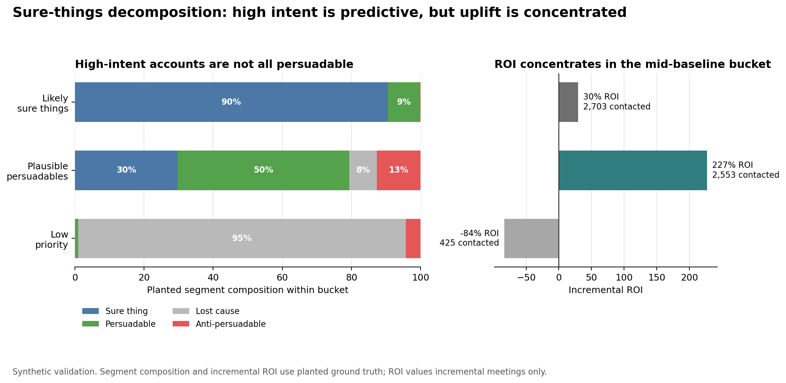

# When High Intent Doesn't Matter

Intent data solves a real GTM problem. It helps sales and marketing teams avoid treating every account the same. If a company is researching your category, hiring around a relevant pain point, visiting your site, or engaging with related content, it probably deserves attention.

But there is a subtle failure mode in how intent data gets used.

Most intent scores answer:

> Who is likely to buy?

That is not the same as:

> Which outreach actions will cause additional pipeline?

The distinction matters because a high-intent list can look excellent while still being dominated by accounts that were already likely to convert under business-as-usual.

## The Propensity Trap

An intent score is usually a conversion-propensity score in operational clothing. This is not the propensity score from causal inference, which models who gets treated. An intent score ranks accounts by expected conversion probability. That is useful for prioritization, but it does not prove that a specific GTM action created the conversion.

For incrementality, the important groups are:

| Segment | Control Outcome | Treated Outcome | Interpretation |
|---|---:|---:|---|
| Sure thing | Converts | Converts | Outreach did not change the outcome |
| Persuadable | Does not convert | Converts | Outreach caused the conversion |
| Lost cause | Does not convert | Does not convert | Outreach did not help |
| Anti-persuadable | Converts | Does not convert | Outreach hurt |

The table is the textbook version. Real accounts are probabilistic, and so is the synthetic data below. A sure thing is not certain to convert. It has the highest baseline rate of any group, and outreach barely moves it. In the synthetic data, planted sure things book a meeting 19.3% of the time without outreach and 20.3% with it, a lift of 1.0 point. Planted persuadables go from 5.0% to 13.0%, a lift of 8.0 points.

In real data, we usually do not observe these labels at the account level. We observe aggregate conversion rates. That is why a high observed conversion rate among high-intent accounts can be misleading.

If high-intent accounts have a 10% control conversion rate and a 12% treated conversion rate, the incremental value of outreach is the 2 percentage-point lift. It is not the full 12% treated conversion rate.

## A Synthetic CRM Example

To make the failure mode concrete, I built a synthetic account-level CRM dataset with planted ground truth.

The data includes:

- account firmographics
- prior website and email engagement
- prior sales touches
- CRM stage before the intent event
- synthetic intent score
- outreach treatment
- meeting and opportunity outcomes
- hidden planted uplift segment

The hidden labels are used only for validation. The diagnostic model does not use them as inputs.

The synthetic high-intent list looks strong at first glance:

```text
Observed meeting rate:
not high intent       4.01%
high intent          13.99%
```

That is exactly why intent products are attractive. High-intent accounts really do convert more often.

But the planted segment composition tells a more complicated story:

```text
High-intent account composition:
sure_thing          51.0%
persuadable         27.2%
lost_cause          15.3%
anti_persuadable     6.5%
```

The high-intent list is predictive, but it is not purely incremental. More than half of the high-intent accounts are sure things in this synthetic setup: accounts with the highest baseline conversion rate under business-as-usual or control conditions, which outreach barely moves.

## The Sure-Things Decomposition

The diagnostic approach is simple:

1. Train a baseline propensity model using only pre-signal features.
2. Estimate each account's business-as-usual conversion propensity.
3. Look at high-intent accounts through that baseline lens.
4. Split high-intent accounts into diagnostic buckets:
   - likely sure things
   - plausible persuadables
   - low-priority accounts
5. Validate the buckets against planted ground truth in the synthetic data.

The model is intentionally modest: a logistic regression trained on untreated accounts using pre-signal features only. The point is not to win a predictive modeling contest. The point is to separate "this account is likely to buy" from "this outreach is likely to create incremental value."

There are two important caveats. First, because the model trains on untreated accounts, a real CRM application would need to address treatment-selection bias in that untreated sample. The clean production remedy is to train on a randomized control arm; a historical pre-program cohort is the fallback when no experiment exists yet. Second, the score is used as a rank-order diagnostic, not as a calibrated probability.

In the synthetic validation, the rank-order check is strong: the Spearman correlation between the diagnostic score and planted control propensity is `0.951` overall and `0.899` within high-intent accounts. That does not remove the production caveat, but it shows the bucket ranking survives the synthetic selection bias.

In the synthetic validation, the decomposition recovers the intended pattern:

```text
Diagnostic bucket composition:
likely_sure_thing          90.5% sure_thing
plausible_persuadable      49.6% persuadable
low_priority               94.7% lost_cause
```

That is the core result. Among high-intent accounts, the top baseline-propensity bucket is mostly sure things. The mid-baseline bucket is where persuadables concentrate.

## Headline Chart



Both panels are synthetic validation views. The left panel uses planted synthetic labels to show what each diagnostic bucket contains. The right panel uses planted ground-truth treatment effects to translate the same buckets into incremental ROI. In real data, that ROI panel would require a holdout, rollout, or another credible lift estimate.

The main readout:

```text
ROI by diagnostic bucket:
likely_sure_thing          29.7%
plausible_persuadable     227.3%
low_priority              -83.5%
```

All three buckets are high-intent accounts. They do not have the same economics.

The likely-sure-thing bucket still has positive ROI in this synthetic example, but it is far less attractive than the plausible-persuadable bucket. The low-priority bucket destroys value.

## Why Total Conversions Overstate Value

The ROI calculation values incremental meetings only.

Assumptions:

```text
cost per SDR touch:              $25
value per incremental meeting:   $10,000
```

In this synthetic example, the incremental meeting counts come from planted ground truth: the difference between each account's treated and control meeting probability. In production, those quantities would need to be estimated from experimental or quasi-experimental variation.

Before quoting a single ROI number, the program has to be defined. Treated accounts split into two groups that are easy to pool by accident: accounts the intent signal flagged, and accounts that were contacted anyway with no intent trigger.

```text
policy                  accounts     spend   baseline   incremental   incr. share     ROI
all outreach (pooled)      8,034  $897,850      885.3         193.7         18.0%   115.7%
intent-triggered           5,681  $717,375      744.7         150.6         16.8%   109.9%
not intent-triggered       2,353  $180,475      140.6          43.1         23.5%   138.8%
```

The pooled row is the one to distrust. In this synthetic world, the accounts the intent score did not flag returned a higher ROI than the accounts it did. Pooling the two groups produces a number that flatters the intent program by crediting it with outreach the program never triggered.

That is the same propensity-versus-uplift confusion this article is about, showing up one level higher. It is not in the model. It is in the reporting.

Taking the intent-triggered program on its own, it is profitable but inefficient.

```text
intent-triggered spend:                 $717,375
spend on non-persuadables:              $524,725
share of that spend:                       73.1%
share of treated meetings incremental:     16.8%
```

Most expected treated meetings are baseline demand. They would have happened under control or business-as-usual. The incremental value comes from the smaller set of meetings created by outreach.

One segment is worse than wasted. Anti-persuadable accounts convert less often once they are contacted. In the synthetic data, their planted meeting rate falls from 5.9% without outreach to 4.4% with it. Inside the intent-triggered program they account for 326 accounts and $40,300 of spend, and they destroy 4.9 meetings. Outreach does not merely fail on them. It removes meetings that would otherwise have happened.

A propensity ranking cannot see that group at all. Those accounts look like good accounts right up until someone contacts them.

This is why a dashboard that reports only treated high-intent conversion can create false confidence. It credits the outreach motion for conversions that may have happened anyway.

The naive treated-versus-untreated comparison shows the problem. Among high-intent accounts, treated accounts booked meetings at 15.81% versus 9.93% for untreated accounts, a naive gap of 5.88 percentage points. The planted true lift for treated high-intent accounts was only 2.65 percentage points. The naive comparison more than doubles the apparent effect because treatment is targeted.

## What Perfect Uplift Targeting Would Do

Because this is synthetic data, we can also calculate an oracle uplift policy using planted ground truth. This is not available in real data. It is an upper bound on what perfect uplift targeting could do.

Three assumptions sit behind these numbers, and each one changes the answer.

First, contacting an account is charged at the average observed cost per treated account, which is $111.76 here. Untreated accounts recorded zero SDR touches, so some per-account cost has to be assumed for any account the real policy never contacted.

Second, the oracle picks from the entire account base, not just the high-intent list. It is therefore a wider comparison than "better targeting inside the intent list."

Third, it ranks on the planted true treatment effect. That quantity is never observable in real data, which is what makes this a benchmark rather than a policy.

```text
policy                            accounts     spend   incremental      profit      ROI
actual policy (all outreach)         8,034  $897,850        193.7  $1,039,080   115.7%
oracle uplift, same volume           8,034  $897,850        357.0  $2,672,650   297.7%
oracle uplift, profitable only       3,953  $441,773        316.2  $2,720,627   615.8%
```

The perfect-uplift result is not the product claim. It is a benchmark. It shows the economic gap between ranking accounts by intent and ranking accounts by incremental response.

## What This Diagnostic Can And Cannot Prove

The sure-things decomposition is useful because it asks a better question than a raw intent score:

> How much of this high-intent list was already high-propensity before the intent signal?

It can help a GTM team see whether its intent program is mostly finding:

- sure things that had the highest baseline conversion rate before any outreach
- persuadables where outreach may create incremental pipeline
- low-priority accounts that look noisy despite an intent spike

But it is not a substitute for causal measurement.

The diagnostic does not prove individual-level uplift. It does not prove real ROI without an experiment or credible quasi-experimental design. In production, stronger claims need one of:

- randomized holdout among high-intent accounts
- staggered rollout by territory or segment
- event-study / difference-in-differences design
- client-run notebook that keeps private CRM data local

The right sequence is:

1. Use the decomposition to identify whether the intent list is plausibly overrun by sure things.
2. Use that evidence to design a holdout or rollout test.
3. Estimate incremental meetings, opportunities, or pipeline from the test.
4. Reallocate GTM effort based on lift, not just propensity.

## The Practical Takeaway

Intent data is not useless. It is often predictive. The problem is treating prediction as proof of incrementality.

For GTM leaders, the question is not whether high-intent accounts convert more often. They usually do.

The question is whether the next sales or marketing action creates additional business that would not have happened otherwise.

That is where the measurement layer belongs.

## Code And Data

Every number in this piece comes from code you can run.

- [`src/generate_synthetic_crm.py`](../src/generate_synthetic_crm.py) builds the synthetic CRM dataset: 20,000 accounts, seed 42, with the planted segments and true treatment effects. Run it with `--summary` to print the observed meeting rates by intent status.
- [`notebooks/sure_things_decomposition.ipynb`](../notebooks/sure_things_decomposition.ipynb) fits the baseline model, builds the diagnostic buckets, validates them against the planted truth, and produces every other table and the headline chart above.

The data is fully synthetic. No real CRM or client data was used.
